# Training Large Language Models on Google Cloud

Large language models are one of the most popular machine learning models. They
have been shown to achieve high scores in benchmarks on different NLP tasks.
There is a tendency of noticeable improvements which have been recorded as the
model size grows. For example, the T5 model comes in various sizes:

* T5 small : 60 million parameters
* T5 base: 220 million parameters
* T5 large: 770 million parameters
* T5 XL: 3 billion parameters
* T5 XXL: 11 billions parameters

The T5 XXL achieves higher benchmark scores on multiple NLP tasks in comparison
to smaller T5 models. When we fine tune it for summarization, we get better
output quality as you can see some of our [sample results](#expected-output)

The challenges of training large language models are multiple. To start with, it
needs a large infrastructure of compute resources. Multiple machines with
multiple hardware accelerators such as GPUs and TPUs are needed to train a
single model. Getting the infrastructure ready for running is just the start of
the challenge. When training starts, it could take multiple days for training to
converge. This, besides the fact that we are training on a large number of
hardware, increases the probability of experiencing a failure during training.
If training fails, we need to restart and get the infrastructure ready again and
resume where we left off.

In addition to these problems, we face the common production ready machine
learning problems. Such as, reliable retraining, data storage, checkpoint
storage, model versioning, tracking model quality and deployment to production.

The
[Hugging Face transformer library](https://huggingface.co/docs/transformers/index)
is a very popular machine learning library that has made the most popular
machine learning models available to a wide range of users. It provides a simple
and standard approach to perform, data preprocessing, training, fine tuning and
inference. In addition, it provided support for deepspeed which is a distributed
machine learning framework that enables the training and finetuning of models
across multiple GPUs and multiple nodes.

Google Cloud Platform is one of the largest cloud providers which provides
compute infrastructure suitable for training large language models.
[Accelerator-optimized machines](https://cloud.google.com/compute/docs/accelerator-optimized-machines)
equipped with NVidia A100 GPU cards, available on GCP, are very capable hardware
VMs that can produce performance when used for training machine learning models.
In addition to the compute infrastructure, GCP offers ML Ops automation services
via [Vertex AI](https://www.nvidia.com/en-us/data-center/a100/). We use Vertex
AI Pipelines to run our fine tuning pipeline. We use Vertex AI Endpoints to
serve our model.

In this effort, we provide a fully functioning example of how can we use GCP
tools as well as the HuggingFace transformer library in conjunction with
deepseed to finetune a large language model (T5 XXL) for a text summarization
task in a production ready pipeline that anyone can run in their own GCP
project. Here is a summary of task and tooling we are going to use:


* **Task**: Text Summarization
* **Implementation**: Hugging Face Transformers library
* **Distributed Framework**: Deepspeed (ZeRO stage 3)
* **Infrastructure**: Google Cloud
 * **Cluster Management**: AI Infra cluster provisioning tool
 * **Production Pipeline**: Vertex AI Pipelines
 * **Model Management**: Vertex AI Models
 * **Deployment for Inference**: Vertex AI Endpoints
 * **Model Storage**: Google Cloud Storage
 * **Data Storage**: Google Cloud Storage

## Quick Start Guide
### Prerequisites

1.  Make sure you have gcloud installed and that you are authenticated including
    application default authentication

    ```bash
    gcloud auth login
    gcloud auth application-default login
    ```

1.  Install kfp and abseil packages

    ```bash
    pip install kfp absl-py google-cloud-aiplatform
    ```

### Instructions

    
Follow these instructions To run T5 training on a GPU cluster:

1.  In your project, enable services needed to run the pipeline. You can do this
    by issuing the following command:

    ```bash
        export PROJECT_ID=<your project ID>
        gcloud services enable aiplatform.googleapis.com cloudfunctions compute.googleapis.com iam.googleapis.com cloudresourcemanager.googleapis.com --project=${PROJECT_ID}
    ```

1.  Create a regional bucket in the same project. Make sure you choose to make
    it a regional bucket and choose the same region as where your pipeline will
    run. us-central1 recommended.

    ```bash
        export BUCKET_NAME=<your choice of a globally unique bucket ID>
        gcloud alpha storage buckets create gs://$BUCKET_NAME --project=$PROJECT_ID --location=us-central1 --uniform-bucket-level-access
    ```

1.  Clone this repo from the repository

    ```bash
    git clone https://github.com/gcp-llm-platform/llm-pipeline.git
    cd llm-pipeline
    ```

1.  Run the following command:

    ```bash
    python3 pipeline.py --project=$PROJECT_ID --pipeline_root=gs://$BUCKET_NAME/pipeline_runs/ --config=configs/<config>
    ```

    Replace **\<config>** with one of the precreated configs below or create
    your own config as described in [here](#customize-my-pipeline):

    *   **small1vm1gpu.json** To create a single VM cluster with 1 A100 GPU and
        finetune T5 small on it.

    *   **small2vm16gpu.json** To create a 2 VM cluster with 16 A100 GPU each
        and finetune T5 small on it.

    *   **xxl2vm16gpu.json** To create a 2 VM cluster with 16 A100 GPU each and
        finetune T5 XXL on it. Caution: takes multiple days

    *   **xxl8vm16gpu.json** To create a 2 VM cluster with 16 A100 GPU each and
        finetune T5 XXL on it. Caution: takes multiple days

    Make sure you have enough Quota for the number of A2 VMs and A100 GPUs you
    select. You can learn more about Google Cloud quota from
    [here](https://cloud.google.com/compute/resource-usage#gpu_quota)

    The tool displays a link to the pipeline after it finishes. Go to the link
    to watch the pipeline progress. The pipeline looks like:

    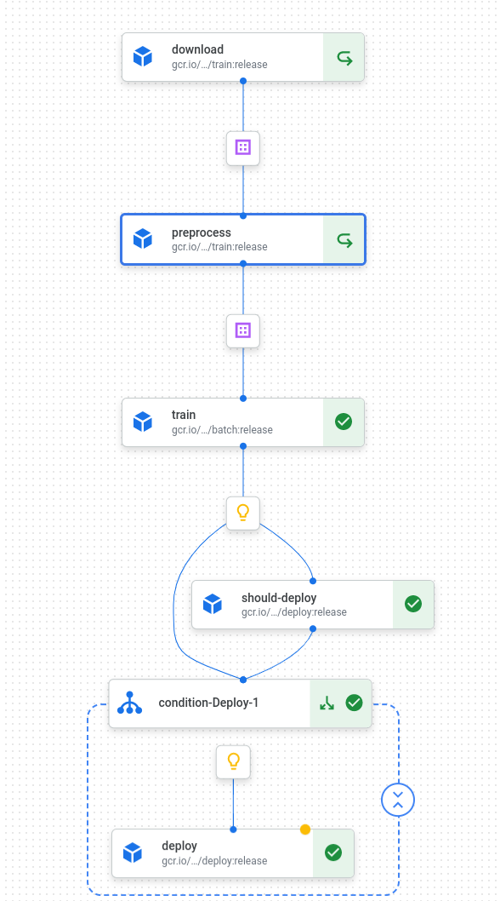

### Test your pipeline

1. After your pipeline completes successfully, expand the 'condition' node and click on the 'deploy' node inside. Under 'Output Parameters', copy the Value of 'endpoint'. Create an environment variable with the value:

    ```bash
    export ENDPOINT_ID="<The value you copied>"
    ```

1. Create a json file with the following content or any article of your choice:

    ```json
    {
    "instances": [
        "Sandwiched between a second-hand bookstore and record shop in Cape Town's charmingly grungy suburb of Observatory is a blackboard reading 'Tapi Tapi -- Handcrafted, authentic African ice cream.' The parlor has become one of Cape Town's most talked about food establishments since opening in October 2020. And in its tiny kitchen, Jeff is creating ice cream flavors like no one else. Handwritten in black marker on the shiny kitchen counter are today's options: Salty kapenta dried fish (blitzed), toffee and scotch bonnet chile Sun-dried blackjack greens and caramel, Malted millet ,Hibiscus, cloves and anise. Using only flavors indigenous to the African continent, Guzha's ice cream has become the tool through which he is reframing the narrative around African food. 'This (is) ice cream for my identity, for other people's sake,' Jeff tells CNN. 'I think the (global) food story doesn't have much space for Africa ... unless we're looking at the generic idea of African food,' he adds. 'I'm not trying to appeal to the global universe -- I'm trying to help Black identities enjoy their culture on a more regular basis.'"
    ]
    }
    ```
    Save the file and give it a name. For this example, prediction.json

1. Do a prediction using the following command:

    ```bash
    curl \
        -X POST \
        -H "Authorization: Bearer $(gcloud auth print-access-token)" \
        -H "Content-Type: application/json" \
        https://us-central1-aiplatform.googleapis.com/v1/projects/${PROJECT_ID}/locations/us-central1/endpoints/${ENDPOINT_ID}:predict \
        -d "@prediction.json"
    ```

### Expected Output

1. If you used a configurtion with the T5 small model (60M parameters), the output would be like:
```bash
{
  "predictions": [
    "'Tapi Tapi -- Handcrafted, authentic African ice cream' is a",
  ],
  "deployedModelId": "8744807401842016256",
  "model": "projects/649215667094/locations/us-central1/models/6720808805245911040",
  "modelDisplayName": "t5",
  "modelVersionId": "12"
}
```

2. If you use a configurtion with the T5 XXL (11B parameters), the output would be like:
```bash
{
  "predictions": [
    "Tapi Tapi is an ice cream parlor in Cape Town, South Africa.",
  ],
  "deployedModelId": "8744807401842016256",
  "model": "projects/649215667094/locations/us-central1/models/6720808805245911040",
  "modelDisplayName": "t5",
  "modelVersionId": "12"
}
```

### Customize your pipeline

Aside from those standard configurations. You can configure your pipeline to run
on any dataset, use any supported model, using any GCP hardware as well as other
configurations. Here is the details of preparing a configuration JSON:

```json
{
 "dataset": "cnn_dailymail",
 "dataset_subset": "3.0.0",
 "document_column": "article",
 "summary_column": "highlights",
 "cluster_prefix" : "t5node",
 "zone" : "us-central1-c",
 "node_count" : 13,
 "model_checkpoint" : "google/t5-v1_1-xxl",
 "machine_type" : "a2-ultragpu-8g",
 "gpu_type" : "nvidia-a100-80gb",
 "gpu_count" : 8,
 "batch_size" : 19,
 "epochs" : 7,
 "model_display_name" : "t5",
 "deploy_machine_type" : "a2-highgpu-2g",
 "deploy_gpu_type" : "NVIDIA_TESLA_A100",
 "deploy_gpu_count" : 2
}
```

Here is a description of what each configuration parameter does:

*   **dataset**: Title of the dataset from huggingface.co. To use a custom
    dataset, this can be set to a GCS path.
*   **dataset_subset**: If the dataset has multiple subsets, this should be the
    dataset subset name. For datasets with no subsets, this should be set to 
    "default".
*   **document_column**: The name of the document column from the dataset.
*   **summary_column**: The name of the summary column from the dataset.
*   **cluster_prefix**: A prefix to name VMs and Instance groups created by the
    pipeline.
*   **zone**: GCP zone to run the pipeline.
*   **node_count**: Number of VM nodes to run finetuning
*   **model_checkpoint**: Name of model checkpoint to start finetuning from.
*   **machine_type**: GCE machine type for fine tuning VMs.
*   **gpu_type**: GPU type to be attached to each finetuning VM.
*   **gpu_count**: Number of GPUs per VM.
*   **batch_size**: Fine tuning batch size.
*   **epochs**: Fine tuning epochs.
*   **model_display_name**: Name of Vertex AI uploaded model and endpoint
*   **deploy_machine_type**: Type of VM used for serving the model after
    deployment. It can be any machine supported by Vertex AI Prediction as
    listed here.
*   **deploy_gpu_type**: Type of GPU attached to serving VM.
*   **deploy_gpu_count**: Number of GPUs attached to serving VM.

## How it works

### Download

This is the ingestion step for the data. Currently, it uses huggingface.co
datasets library. To learn more about loading datasets using this library, check
out the library [reference](https://huggingface.co/docs/datasets/loading).
Eventually, the data is downloaded to Google Cloud Storage (GCS). The next steps
in the pipeline are expecting the data to be in GCS. This works well for
datasets in the multi GB order of magnitude. In our future work, we will present
how to process larger datasets using DataFlow. The full training scripts can be
found [here](src/download.py).

We package this as a pipeline component that produces the dataset on GCP. The
component takes the dataset and subset as input. These correspond to the ‘path’
and ‘name’ parameters passed directly to datasets.load_dataset. You can learn
more about loading datasets here:

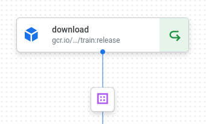
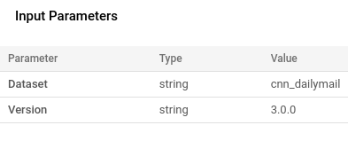

In the example, we use the
[CNN Dailymail dataset](https://huggingface.co/datasets/cnn_dailymail). The code
is packaged in a container available [here](gcr.io/llm-containers/train).

## Preprocessing

As part of the summarization task, we tokenize our dataset during the
preprocessing stage. The full script for tokenization can be found [here]. When
we are finished processing, we upload the tokenized dataset to the output GCS
path.

This component allows the use of dataset formats supported by
[datasets.load_dataset](https://huggingface.co/docs/datasets/v1.11.0/loading_datasets.html).
All the user needs to do is specify which column in the dataset contains the
document body and which column contains the document summary.

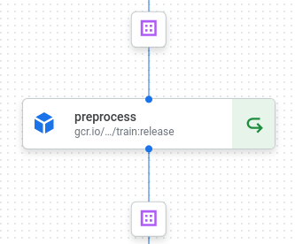
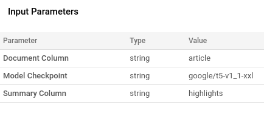

### Fine Tuning

In this step of the pipeline we take the tokenized dataset and train a base
model to be finetuned on the dataset. For large language models, this is
typically the step that consumes most resources and takes a significant amount
of time. Depending on how much GPUs are used for training and how many epochs
you run the training for, this could vary from hours to days.

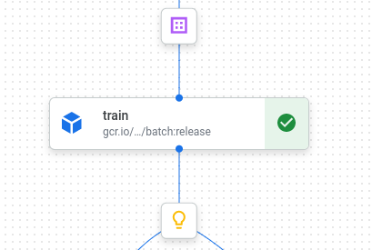
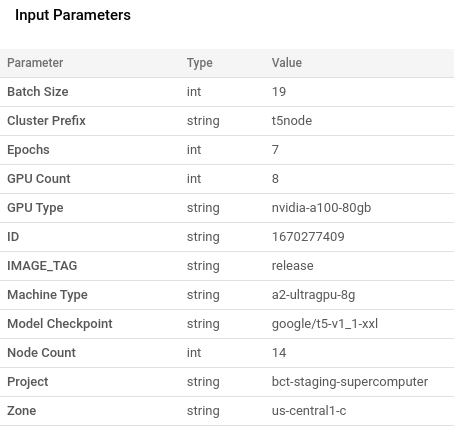

The general workflow for finetuning is that we spawn a cluster of GPU VMs on
GCP. In the example shown we use 8 A2 plus matches with 8 A100 GPUs. We
preprovision them with [DLVM](https://cloud.google.com/deep-learning-vm) images
that include the necessary GPU drivers including NVidia Common Communication
Library ([NCCL](https://developer.nvidia.com/nccl)). We download our training
code which is packaged in a docker image. And use
[deepspeed](https://www.deepspeed.ai/) to launch and coordinate our training
across all the VMS. We use [fluentd](https://www.fluentd.org/) to collect logs
from the VMs and upload to
[Google Cloud Logging](https://cloud.google.com/logging). We save model
checkpoints to GCS including the final trained model.

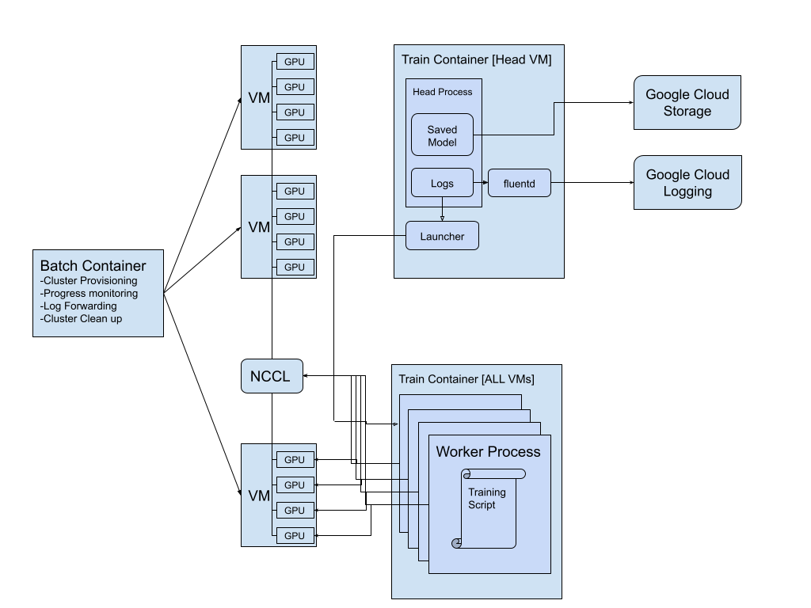

Let’s look at the implementation of some of these parts:

#### Cluster Provisioning

To provision the cluster of VMs, we use a pre created container we call ‘batch
container’ . The container is available [here](gcr.io/llm-containers/batch). It
is based on the cluster provisioning tool container available
[here](gcr.io/llm-containers/cluster-provision-image). Creating VMs using the
tool is as simple as filling a few environment variables and calling an entry
point. It will automatically create the cluster with an image of choice and run
a starting command on all VMs.

When the job completes successfully, we call the entry point again requesting
the destruction of the cluster.

#### Training Container

All the VMs will be provisioned with the DLVM image with NVidia drivers
preinstalled. The VMs will download the training docker image and invoke the
training start command. The training container is available
[here](gcr.io/llm-containers/train) . And you can find the fine tuning scripts
[here](src/finetune.py).

The container image has some pre-installed packages and configuration. This
includes:

*   Transformer libraries and deepspeed with compiled ops
*   ssh server that allows deepspeed launcher to launch training inside the
    container
*   Google Cloud logging agent to collect logs from the container and publish to
    the cloud.
*   Training scripts

The head node will invoke the head script which:

*   Configures ssh to talk to all servers in the cluster
*   Configures fluentd to collect logs
*   Invokes deepspeed with correct config to run the training script using ZeRO
    stage 3

In turn, deep speed would use its default ssh launcher to launch the training
scripts on all cluster containers.

#### Saving to GCS

The training scripts use the Huggingface transformer library to finetune a
summarization task on the given dataset. To save the progress of training as it
goes, we create a training callback that uploads each checkpoint to GCS. The
call back looks like this:

```python
class GCSSaveCallback(TrainerCallback):
 """A [`TrainerCallback`] that handles checkpoints.
 """

 def on_save(self, args: TrainingArguments, state: TrainerState,
             control: TrainerControl, **kwargs):
   checkpoint_folder = f'checkpoint-{state.global_step}'
   local_output_dir = os.path.join(args.output_dir, checkpoint_folder)
   if not os.path.exists(local_output_dir):
     logging.error(
          'Check point called for a non existing checkpoint %s',
          local_output_dir,
     )
     return
   gcs_root, gcs = utils.gcs_path(FLAGS.gcs_output)
   gcs_output_dir = os.path.join(gcs_root, local_output_dir)
   logging.info('Uploading %s....', gcs_output_dir)
   gcs.put(local_output_dir, gcs_output_dir, recursive=True)
   return None
```

When the model is completely trained, we save the final copy to GCS.

#### Evaluation and metrics

When the model finishes training, we run our evaluation to collect the model
accuracy number. In this case, since it is a summarization task, we collect
ROUGE scores for the model. You can learn more about ROUGE scores
[here](https://towardsdatascience.com/the-ultimate-performance-metric-in-nlp-111df6c64460).
Once we have the final scores, we save them along the model to GCS. By saving
the model metrics along with the model, we are able to figure out the model
performance just by looking at the saved model without having to run evaluation
again as in the example below:

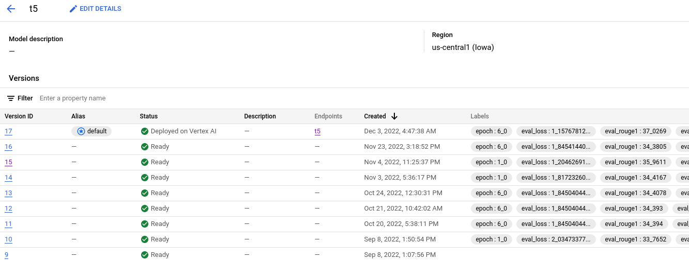

### Model deployment

Now that our model is ready, we want to provide it as a service for authorized
users to call. This can serve as a backend to a frontend web application. We go
with a simple and quick solution to demo our model. For larger models or
production class deployment, we could use an Nvidia
[Triton Inference Server](https://developer.nvidia.com/nvidia-triton-inference-server).
For this purpose, we use
[Vertex AI Prediction](https://cloud.google.com/vertex-ai/docs/predictions/get-predictions)
which provides us with the quickest path to serve our model. In future work, we
will discuss serving using NVidia Triton Inference Server.

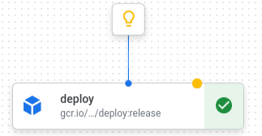
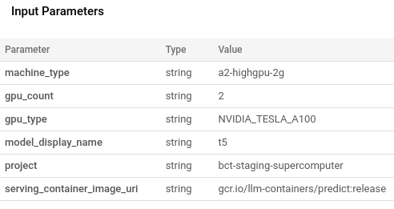

We package the model serving code in a simple prediction container which is
available [here](httpgcr.io/llm-containers/predict). The container packs a Flask
server with a simple python script that uses deepspeed to perform prediction
from the model. It implements the necessary REST APIs required by Vertex AI
Prediction.

### Deciding to deploy 

When we upload the model to Vertex AI, we attach the model metrics as labels to
the model. This way we can easily look up the model accuracy just by looking at
the model in Vertex AI. This also helps us compare metrics between newly trained
models and previously deployed models to decide whether the new model is
performing better than the previous model. This assures us that we are always
improving the model performance as we run the training pipeline in consecutive
iterations.

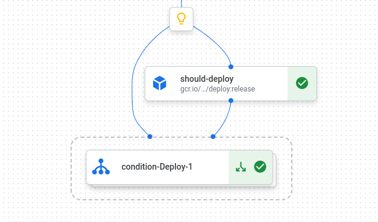

## Current Pipeline Limitations

### Data

The pipeline only supports data that is loadable using
[load_dataset](https://huggingface.co/docs/datasets/v1.11.0/loading_datasets.htmlhttps://huggingface.co/docs/datasets/v1.11.0/loading_datasets.html).
It works well for data less than 100GB. For larger dataset, users will need to
write custom processing scripts on Dataflow.

### Compute

The pipeline VM types supported by GCP Compute Engine. For a full list, check
[GCE GPU Platforms](https://cloud.google.com/compute/docs/gpus). You can create
a cluster of any size as long as you have the quota for it.

### Models

For the summarization task, we support any sequence to sequence model in the
huggingface.co model repository. This includes T5, mT5, BART and Marian models.
For more information about sequence 2 sequence models, check
[here](https://huggingface.co/course/chapter1/7). The model can be of any size
as long as corresponding parameters (batch size, number of nodes, number of
GPUs, etc ..) can make the model fit into the compute cluster.

### Deployment Scale

Currently we support SKUs that are available for Vertex AI Prediction which can
be found
[here](https://cloud.google.com/vertex-ai/docs/predictions/configure-compute#machine-types).

## Future Work

### Dataflow Processing

To process larger datasets, preprocessing can’t happen on a single node. It
needs to be done in parallel using Dataflow. We will add support to processing
large datasets using Dataflow. This will allow training on large corpuses (e.g
C4) .

### NVidia Megatron

Currently, the pipeline uses deepspeed ZeRO for model partitioning which uses
distributed data parallel processing of the model. To allow even larger models
(e.g. GPT3) and use Model Parallel , we will add support to NVidia Megatron.

### More Tasks

We currently only implement a summarization task. We can add support to more
tasks that support different classes of models (e.g. encoder only and decoder
only models).

### Integration with DGCM monitoring

With the new
[release](https://cloud.google.com/blog/products/containers-kubernetes/monitoring-gpu-workloads-on-gke-with-nvidia-data-center-gpu-manager)
of the DGCM monitoring plugin for GKE, we will be able to view GPU metrics in
the cluster as the training makes progress. This will allow for better
visibility and profiling.

### NVIDIA Triton Server

We can switch serving to an NVidia triton server instead of deepspeed. This will
allow for very fast inference suitable for production use.

### Automatic restart from a check point  of failure

Currently restart is done manually from a checkpoint. We need to have failure
detection and automatic restart from the last checkpoint if a failure occurs.
